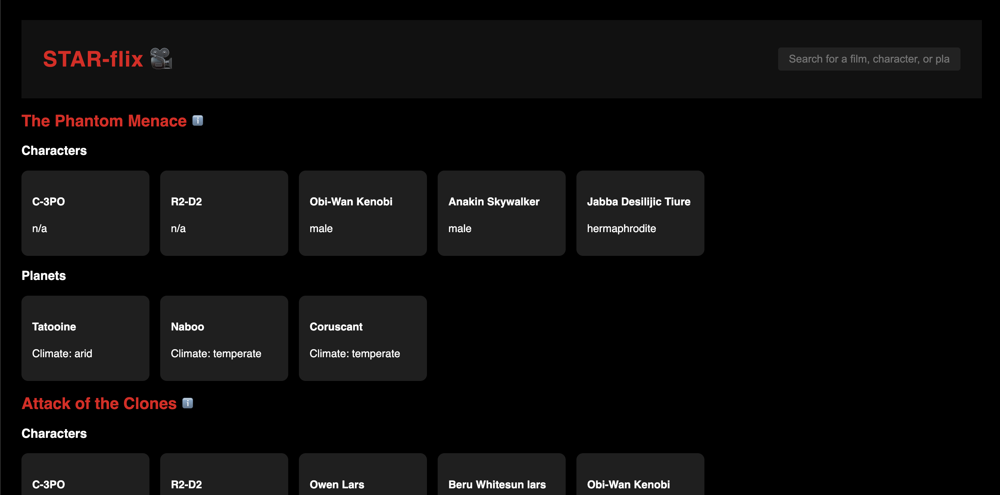

# STAR-flix

A Star Wars Explorer built with **React**, styled with custom CSS, powered by the -> SWAPI API(https://swapi.py4e.com/).  
Search, explore, and dive into characters, films, and planets of the Star Wars universe.



---

## Features

- **Global Search**: Find movies, characters, or planets instantly
- **Categorized Display**: Browse content grouped by film
- **Character & Planet Modals**: Detailed popups with film links or inhabitants
- **Debounced Search**: Optimized input handling
- **Caching**: Avoids repeated API calls

---

## 📦 Tech Stack

- React (via Vite)
- Axios (for API calls)
- Custom 'useDebounce' hook
- Styled with CSS (no frameworks)
- SWAPI - (https://swapi.py4e.com/)

---

## Setup Instructions

### 1. Clone the repo

```bash
git clone https://github.com/your-username/starflix.git
cd starflix
npm install
npm run dev
```
